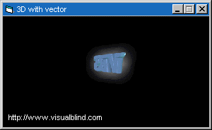



## a 3D animation with flash\(vector\)

### Description

This shows you how to use the macromedia flash/shockwave ocx. Also demonstrates 3D animation in a vector based environment with Flash.
 
### More Info
 

             |
---                |---
**Submitted On**   |2000-11-22 22:09:34
**By**             |[VisualBlind](https://github.com/Planet-Source-Code/PSCIndex/blob/master/ByAuthor/visualblind.md)
**Level**          |Beginner
**User Rating**    |3.7 (44 globes from 12 users)
**Compatibility**  |VB 6\.0
**Category**       |[Miscellaneous](https://github.com/Planet-Source-Code/PSCIndex/blob/master/ByCategory/miscellaneous__1-1.md)
**World**          |[Visual Basic](https://github.com/Planet-Source-Code/PSCIndex/blob/master/ByWorld/visual-basic.md)
**Archive File**   |[CODE\_UPLOAD1195911232000\.zip](https://github.com/Planet-Source-Code/visualblind-a-3d-animation-with-flash-vector__1-13036/archive/master.zip)

